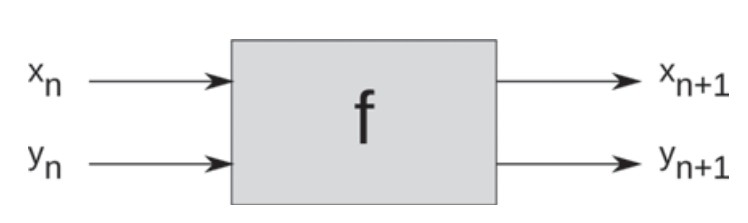

# Index 
<ol><!-- Tag for ordered list -->
    <li><!-- list item -->
        <a href="#mathematics">Mathematics</a>
        <ul><!-- Tag for unordered list -->
            <li><a href="#two-dimensional-discrete-dynamical-systems">Two dimensional discrete dynamical systems</a></li>
        </ul>
    </li>
</ol>

# Mathematics

### Two dimensional discrete dynamical systems
In this kind of systems, there is a **function** that takes 2 numbers as input, and returns two numbers as outputs. Note that this is not the same as two separate functions. The process should be seen as one multi input and multi-output function. The output for y depends not just on the input of y but also on the input of x.

* If a one dimensional dynamical system gives us an scalar in R1, a two dimensional system gives us a point in R2 --> (x, y)

#### The Hénon map
Functions are also commonly refered as **maps** by mathematicians, so map = function. 

$$
\begin{align*}
x_{n+1} &= y_n + 1 - a x_n^2 , \\
y_{n+1} &= b x_n ,
\end{align*}
$$

**References of this section:**
* [Feldman, D. P. (2012). Chaos and fractals: an elementary introduction. Oxford University Press.](https://dpfeldman.github.io/Chaos/index.html)

### Differential equations

#### Computational solutions

# dynamical-systems-modeling

## Important references and links:

* Web page of the professor David P. Feldman for comparing software and further readings: http://hornacek.coa.edu/dave/Chaos/programs.html

## Description
The purpose of this repo is to study dynamical systems theory, using python code. 